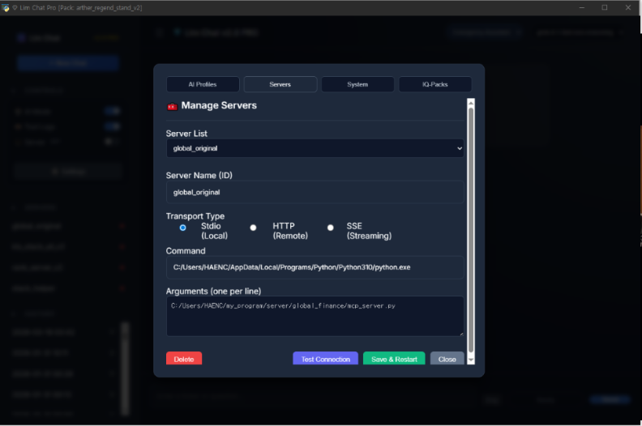

# MCP ASDK Studio v0.9-4 (Public Beta) 🚀

> **"Your High-Performance, Free Alternative to Commercial AI Desktops"**


*Professional Setup Interface: Connect local scripts, configure AI profiles, or remote SSE servers with ease.*

## Live Workspace Evidence
MCP ASDK Studio provides a practical, desktop-first environment for AI tool orchestration.

It connects to live MCP servers, exposes visible tool inventories, and generates **fact-grounded outputs** from multiple sources including market data, SEC filings, and news summaries.

Typical workflow:
1. **Connect** MCP servers
2. **Inspect** available tools
3. **Ask** a ticker or domain question
4. **Review** the combined analysis
5. **Expand** raw tool results for verification


**Live MCP server connections and tool inventory**


**Structured multi-tool analysis inside the workspace**


**Expandable raw outputs for inspection and verification**

**MCP ASDK Studio is a 100% Free, Open-Source AI development workspace. (v0.9-4 Public Beta)**
*Actual Product UI - Experience the premium 'Lim Chat PRO' engine for free.*

---

[](LICENSE)
[](docs/ko/PRODUCT_OVERVIEW.md)
[](docs/en/PRODUCT_OVERVIEW.md)
[](docs/ko/PRODUCT_OVERVIEW.md)

## 💎 Why choose ASDK Studio?
- **Commercial-Grade Engine**: Migrated from the verified `Lim Chat PRO` architecture.
- **True Alternative**: Full support for MCP servers and custom AI providers, rivaling commercial chatbot desktops.
- **AI-Powered Customization**: Built with a clean Python/JS structure. Use AI to fix, modify, and expand the studio to fit your unique needs.
- **100% Privacy**: No tracking. Your keys and data stay on your local machine.

## 🚀 Quick Start
1. **Clone**: `git clone https://github.com/lim-asdk/asdk_09-mcp_asdk_studio_v0_9-4.git`
2. **Setup**: Copy `user_data/profiles/profile.sample.json` to `default.json` and add your API key.
---

## 🏗️ Architecture: L1-L4 Vertical Alignment
```text
[L4] WILL (Intelligence)  : Personas, Prompts, Logic Flow
            ↑
[L3] BRIDGE (Orchestrator): ProBridgeAPI, ExpertRunner, Tool Router
            ↑
[L2] LOGIC (Processing)   : Data Filtering, Auth Bridge, Reasoner
            ↑
[L1] PHYSICAL (Infra)     : PathManager, user_data, keys, .env
```

## ⚡ V5 Bootstrap Guide
Get the system running in 4 easy steps:
1. **Environment**: Create a `.env` file (optional) to override `DATA_ROOT`.
2. **Dependencies**: `pip install -r requirements.txt`
3. **Authentication**: Place JSON keys in the `keys/` directory and set `GOOGLE_APPLICATION_CREDENTIALS` if needed.
4. **Diagnostics & Launch**: 
   - Run `python check_health.py` to verify system integrity.
   - Run `python main.py` to launch the studio.

## 📂 Project Structure
- `main.py`: Desktop Launcher & Entry Point.
- `check_health.py`: System Integrity Diagnostic Tool.
- `lim_chat_pro/`: Core Vertical AI Engine & UI Assets.
- `user_data/`: Local private data (Profiles, History, MCP configs). **(Git Excluded)**
- `keys/`: Secure authentication keys storage. **(Git Excluded)**
- `docs/`: Multi-language documentation and reports.

---
## 📖 Documentation
- [Quick Start Guide (EN)](docs/en/QUICK_START.md) / [빠른 시작 (KO)](docs/ko/QUICK_START.md)
- [English Setup Guide](docs/en/SETUP_GUIDE.md)
- [Auth Setup Guide](keys/README_AUTH.md)
- [Public Release & AI Optimization Guide](docs/RELEASE_GUIDE_V5.md)
- [Development Reports](docs/reports/개발_진행_상황.md)

© 2026 **lim_hwa_chan**. Released for the community.
## ?? Future Blueprint: V6 Matrix System & APLC Architecture

While this v0.9-4 Public Beta provides a robust desktop-first workspace, it is fundamentally the stepping stone towards the **V6 Matrix System**?an infinitely scalable, multi-surface intelligence architecture. Future updates will transition this single-instance studio into a decentralized **APLC (AI Program Logic Controller)** network.

Here is the architectural roadmap for upcoming iterations:

### 1. Room-Based Infinite Expansion
We are shifting from standard software logic to hardware-like intelligence orchestration.
* **Zero-Code Cloning**: Scaling the system will be as simple as copying the `room_01` directory to `room_02`, `room_03`, etc.
* **Component Isolation**: Each "Room" acts as an independent memory module (RAM), capable of housing different models (GPT-4, Claude, Gemini) or distinct API keys. This guarantees maximum stability, akin to plugging parallel hardware components from different manufacturers into a single motherboard.

### 2. Cool Fail-over & The MMU Router
The routing mechanism will no longer process complex AI states. It will operate purely as a high-speed delivery protocol.
* **Blind Delivery Protocol**: If a Room fails to respond, the Router instantly drops the payload into the adjacent Room's inbox. The system never halts.
* **MMU-Style Health Sweeps**: On boot, the system conducts a comprehensive sweep of all Rooms, assigning strict `[Healthy]` or `[Bad]` labels. The Router functions like a Memory Management Unit (MMU), delivering data only to verified `[Healthy]` addresses.

### 3. Multi-Surface Architecture
The system will be physically divided into isolated operational planes:
* **User Surface**: A hyper-simplified UI for final outputs.
* **Operator Surface**: For system monitoring, prompt orchestration, and overriding AI actions.
* **Developer Surface**: The core logic and routing manipulation plane.

> **Note to Contributors:** All future pull requests and feature proposals must align with the **Pointer-Only** principle (passing coordinates, not duplicating data) and the physical isolation of the L1-L4 intelligence layers.
