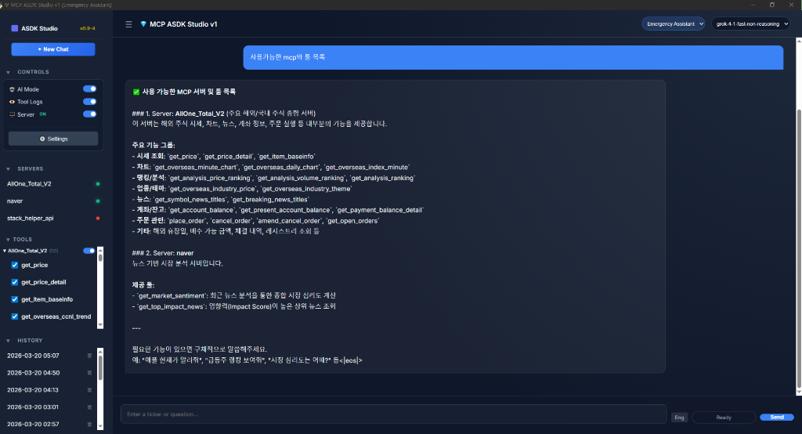
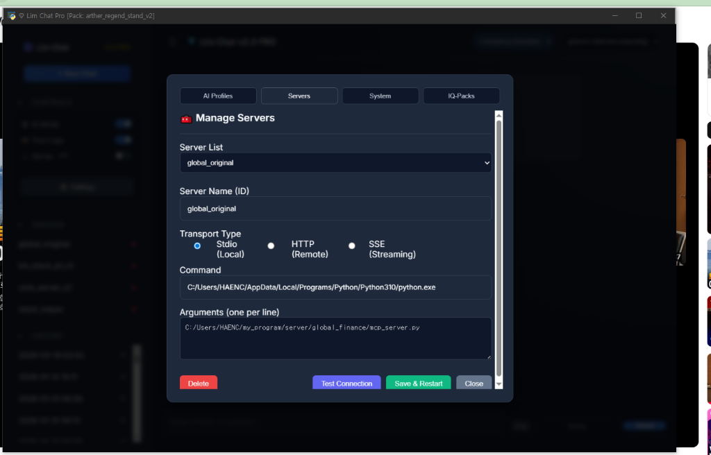

# MCP ASDK Studio v0.9-4 (Public Beta) 🚀

> **"Your High-Performance, Free Alternative to Commercial AI Desktops"**



*Professional Setup Interface: Connect local scripts or remote SSE servers with ease.*

**MCP ASDK Studio is a 100% Free, Open-Source AI development workspace.**
*Actual Product UI - Experience the premium 'Lim Chat PRO' engine for free.*

---

[](LICENSE)
[](docs/ko/PRODUCT_OVERVIEW.md)
[](docs/en/PRODUCT_OVERVIEW.md)
[](docs/ko/PRODUCT_OVERVIEW.md)

## 💎 Why choose ASDK Studio?
- **Commercial-Grade Engine**: Migrated from the verified `Lim Chat PRO` architecture.
- **True Alternative**: Full support for MCP servers and custom AI providers, rivaling commercial chatbot desktops.
- **AI-Powered Customization**: Built with a clean Python/JS structure. Use AI to fix, modify, and expand the studio to fit your unique needs.
- **100% Privacy**: No tracking. Your keys and data stay on your local machine.

## 🚀 Quick Start
1. **Clone**: `git clone https://github.com/lim-asdk/asdk_09-mcp_asdk_studio_v0_9-4.git`
2. **Setup**: Copy `user_data/profiles/profile.sample.json` to `default.json` and add your API key.
---

## 🏗️ Architecture: L1-L4 Vertical Alignment
```text
[L4] WILL (Intelligence)  : Personas, Prompts, Logic Flow
            ↑
[L3] BRIDGE (Orchestrator): ProBridgeAPI, ExpertRunner, Tool Router
            ↑
[L2] LOGIC (Processing)   : Data Filtering, Auth Bridge, Reasoner
            ↑
[L1] PHYSICAL (Infra)     : PathManager, user_data, keys, .env
```

## ⚡ V5 Bootstrap Guide
Get the system running in 4 easy steps:
1. **Environment**: Create a `.env` file (optional) to override `DATA_ROOT`.
2. **Dependencies**: `pip install -r requirements.txt`
3. **Authentication**: Place JSON keys in the `keys/` directory and set `GOOGLE_APPLICATION_CREDENTIALS` if needed.
4. **Diagnostics & Launch**: 
   - Run `python check_health.py` to verify system integrity.
   - Run `python main.py` to launch the studio.

## 📂 Project Structure
- `main.py`: Desktop Launcher & Entry Point.
- `check_health.py`: System Integrity Diagnostic Tool.
- `lim_chat_pro/`: Core Vertical AI Engine & UI Assets.
- `user_data/`: Local private data (Profiles, History, MCP configs). **(Git Excluded)**
- `keys/`: Secure authentication keys storage. **(Git Excluded)**
- `docs/`: Multi-language documentation and reports.

---
## 📖 Documentation
- [Quick Start Guide (EN)](docs/en/QUICK_START.md) / [빠른 시작 (KO)](docs/ko/QUICK_START.md)
- [Auth Setup Guide](keys/README_AUTH.md)
- [Public Release & AI Optimization Guide](docs/RELEASE_GUIDE_V5.md)
- [Development Reports](docs/reports/개발_진행_상황.md)

---
© 2026 **lim_hwa_chan**. Released for the community.

## 📂 Core Principles
- **Open for Innovation**: This is a "Practice-Ready" environment. We encourage you to **modify the code with AI** and share your improvements.
- **Layered Stability**: Robust performance via the L1-L5 engine structure.

## 🔒 Security & Privacy
We prioritize your privacy. No API keys or personal paths are stored in the code. Users must manually manage their keys in the `user_data/` folder.

---
© 2026 **lim_hwa_chan**. Released for the community.
