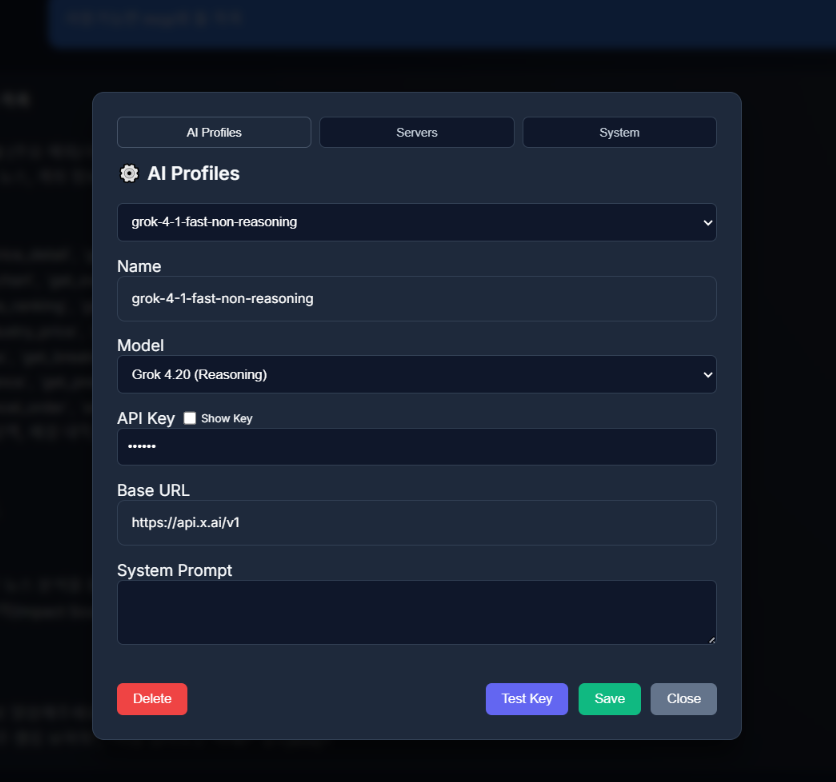

# Setup Guide

This guide is for the public beta workspace skeleton. It explains the Studio tabs,
the JSON files behind them, and the safest way to connect AI profiles and MCP servers
without getting tripped up by the UI.

## 1. Before You Start

- Keep secrets in `user_data/`.
- Use `Save & Restart` after changing a server.
- Use `Test Connection` only after the config fields are filled in.
- For `http` and `sse`, leave `Headers` empty unless the endpoint really requires auth.

## 2. AI Profiles

The **AI Profiles** tab edits one local profile JSON file at a time.

- `Name` is the human-friendly profile label.
- `Model` is the provider model ID.
- `API Key` is stored locally in `user_data/profiles`.
- `Base URL` points to the provider endpoint.
- `System Prompt` sets the assistant behavior.

Workflow:

1. Select a profile from the dropdown.
2. Edit the fields.
3. Click **Save** in the AI profile panel.
4. Use **Test Key** to confirm the key works.

## 3. MCP Servers

The **Servers** tab edits one MCP server JSON file at a time.

### Stdio

Use `stdio` for local scripts.

- `Command` is usually a Python executable.
- `Arguments` contains the script path and optional arguments.
- Keep the script output clean. Extra `print()` output can break MCP startup.

### HTTP / SSE

Use `http` or `sse` for remote or loopback streaming servers.

- `URL` is required.
- `Headers` are optional.
- Do not paste a placeholder `Authorization=Bearer token` unless the server really needs it.

For a local loopback HTTP/SSE server, the config may also include `command` and `args`.
That lets the studio start the backing process automatically before connecting.

Workflow:

1. Select a server from the dropdown.
2. Pick the transport type.
3. Fill in `Command` and `Arguments` for `stdio`, or `URL` for `http` / `sse`.
4. Leave `Headers` blank unless authentication is required.
5. Click **Test Connection**.
6. A healthy connection should return the server's tool list.
7. Click **Save & Restart** when the server is ready.

## 4. How The Studio Reads Your Setup

- The **AI JSON** panel shows the currently selected AI profile file.
- The **MCP JSON** panel shows the currently selected MCP server file.
- Saving writes the file back to `user_data/`.
- If you close the page without saving, the edits stay in memory only.

## 5. What To Expect At Startup

- The desktop UI opens first.
- MCP servers connect in the background.
- A server can be in `connected`, `connecting`, or `failed` state.
- One failed MCP server does not need to block the whole studio.

## 6. Troubleshooting

- If a server says `Failed to fetch` or `All connection attempts failed`, check the `URL`, port, and whether the process is actually running.
- If `stdio` fails, verify the Python path and script path in `Command` and `Arguments`.
- If a server needs auth, add headers one per line in `Key=Value` format.
- If the server does not need auth, keep `Headers` empty.

## 7. Recommended Public Repo Rule

For a public GitHub release, it is safer to keep:

- `user_data/` out of Git
- API keys out of screenshots
- Local ports and private paths masked when you publish images
