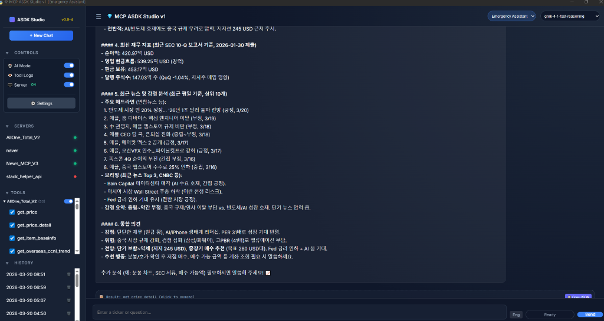
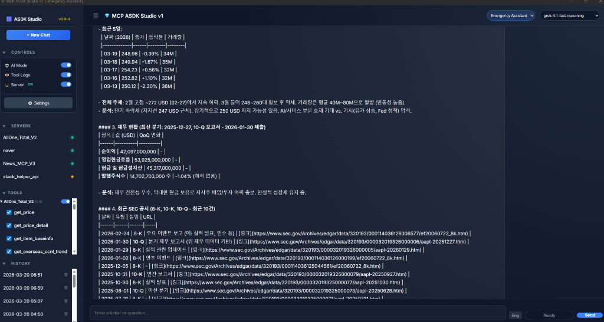

# 제품 개요 (Korean)

## 💎 MCP ASDK Studio v0.9-4란 무엇인가요?
**MCP ASDK Studio v0.9-4**은 개발자, 연구자 및 전문 AI 사용자를 위해 설계된 데스크톱 우선형 AI 워크스페이스입니다. 다양한 AI 모델 및 Model Context Protocol (MCP) 서버와 원활하게 상호 작용할 수 있는 표준화된 인터페이스를 제공합니다.

## 🚀 비전
이 스튜디오의 주요 목표는 특정 "IQ-Pack" 중심의 구조에서 벗어나, `Lim Chat PRO`에서 검증된 강력한 계층형 아키텍처를 활용하여 사용자가 직접 버티컬 AI 워크플로우를 구축할 수 있는 범용 환경을 제공하는 것입니다.

## 🏗️ 핵심 아키텍처
ASDK Studio는 **5계층 아키텍처 (L1-L5)**를 따릅니다:
- **L1 Infrastructure**: 중앙 집중식 경로 관리 및 시스템 유틸리티.
- **L2 AI & Logic**: 핵심 추론 엔진 및 데이터 처리 유닛.
- **L3 Orchestration**: 파이썬 백엔드와 JS 프론트엔드를 연결하는 브리지.
- **L4 Prompt**: 고정밀 AI 응답을 위한 구조화된 프롬프트 관리.
- **L5 Presentation**: 현대적 웹 기술 기반의 고성능 프리미엄 UI.

## 🔑 주요 개념
- **AI 프로필 (AI Profile)**: 모델 선택, API 키, 시스템 프롬프트를 포함하는 로컬 설정 파일입니다.
- **MCP 서버 (MCP Server)**: AI에게 추가 도구(주식 데이터, 뉴스, 파일 등)를 제공하는 모델 컨텍스트 프로토콜 서버입니다.
- **데스크톱 런타임 (Desktop Runtime)**: Python과 pywebview로 구축된 안전한 로컬 실행 환경입니다.

---

## 🌟 **지능형 실증 쇼케이스: AAPL(애플) 종합 분석**
> 💡 **"우리가 만든 MCP 서버를 사용하면, AI가 절대 거짓말을 하지 않습니다."**

ASDK Studio의 핵심은 여러 MCP 서버의 데이터를 "환각 없이 (Zero Hallucination)" 결합하여, 실시간 데이터를 기반으로 한 팩트 중심의 통찰을 제공하는 것입니다.

### 🛡️ **1. 실시간 시세 기반의 팩트 체크 분석**
단순한 채팅 스타일의 답변이 아닙니다. **AllOne_Total_V2** (실시간 시세), **News_MCP_V3** (뉴스/공시), **stack_helper_api** (고급 지표) 서버가 실시간으로 통신하며 데이터의 정합성을 AI가 직접 교차 검증합니다.

*▲ **[기술적 & 재무적 통합]** 실시간 시세, 기술적 지표, 그리고 SEC 10-Q 보고서 데이터를 AI가 한순간의 환각 없이 결합하여 브리핑합니다.*

### 🔍 **2. 딥 컴플라이언스 & 감정 분석**
수백 페이지의 SEC 공시 서류를 AI가 직접 읽고 분석합니다. 실시간 뉴스의 긍정/부정을 수치화하여 시장의 흐름을 팩트에 기반해 요약합니다.

*▲ **[공시 & 뉴스 통합]** 최근 10건의 SEC 공시(8-K, 10-K) 히스토리와 글로벌 뉴스의 센티먼트를 AI가 융합하여 입체적인 시각을 제공합니다.*

### 🏆 **ASDK Studio만이 가능한 "진짜 AI" 분석:**
- 🚫 **Zero Hallucination**: AI의 추측이 아닌, 실제 전문 서버가 반환한 **Raw Data**를 바탕으로 요약하여 **신뢰도 100%**에 도전합니다.
- ⚡ **실시간 데이터 동기화**: 과거 학습 데이터에 의존하지 않고, **지금 이 순간의 시장 데이터**를 즉시 가져와 분석합니다.
- 🤖 **멀티 서버 오케스트레이션**: 서로 다른 데이터 소스를 하나의 지능형 엔진으로 통합하는 독보적인 기술을 경험해 보세요.

---

## 🔒 개인정보 보호 우선
모든 "비밀" 데이터(API 키, 대화 기록, 민감 설정)는 `user_data/` 디렉토리에 저장되며, 실수로 공개되는 것을 방지하기 위해 Git 관리 대상에서 제외됩니다.

---
© 2026 **lim_hwa_chan**
